# Design Diagrams

This document collects architecture and design diagrams for the Swedeb API: sequence diagrams, state diagrams, component diagrams, and other visual documentation of system behavior and structure.

Diagrams here describe the **current or proposed active runtime**. Historical diagrams belong in `docs/archive/`. Proposal-specific diagrams may live in `docs/change_requests/` alongside the relevant proposal and be promoted here once implemented.

---

## KWIC Async Archive Export

**Status**: Implemented. See [docs/change_requests/done/KWIC_ASYNC_ARCHIVE_EXPORT.md](change_requests/done/KWIC_ASYNC_ARCHIVE_EXPORT.md) for the full proposal.

### Sequence: Async archive preparation and retrieval

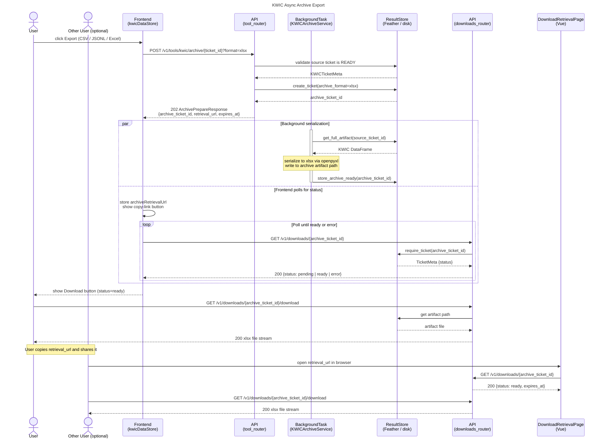

---

## Ticket-Based Bulk Archive Generation (Speeches / Word-Trend Speeches)

**Status**: Implemented. See [docs/change_requests/done/TICKET_BASED_BULK_ARCHIVE_GENERATION.md](change_requests/done/TICKET_BASED_BULK_ARCHIVE_GENERATION.md) for the full proposal.

This flow applies to both:
- `POST /v1/tools/speeches/archive/{ticket_id}`
- `POST /v1/tools/word_trend_speeches/archive/{ticket_id}`

### Sequence: Async bulk archive preparation and retrieval

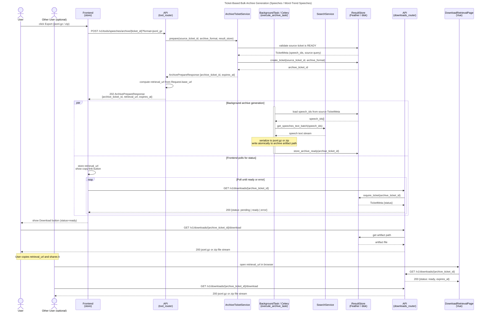

---

## Download Retrieval Page — Four States

**Status**: Implemented. See [docs/change_requests/done/TICKET_DOWNLOAD_URL_RETRIEVAL_PAGE.md](change_requests/done/TICKET_DOWNLOAD_URL_RETRIEVAL_PAGE.md) for the full proposal.

The Vue frontend route `/download/:archiveTicketId` (`DownloadRetrievalPage.vue`) renders one of four states based on the ticket status returned by `GET /v1/downloads/{archive_ticket_id}`. The inline polling flow (user stays on the tool page) is the primary path; the retrieval page is the fallback for tab-close, network loss, or sharing.

### State: ticket lifecycle and retrieval-page rendering

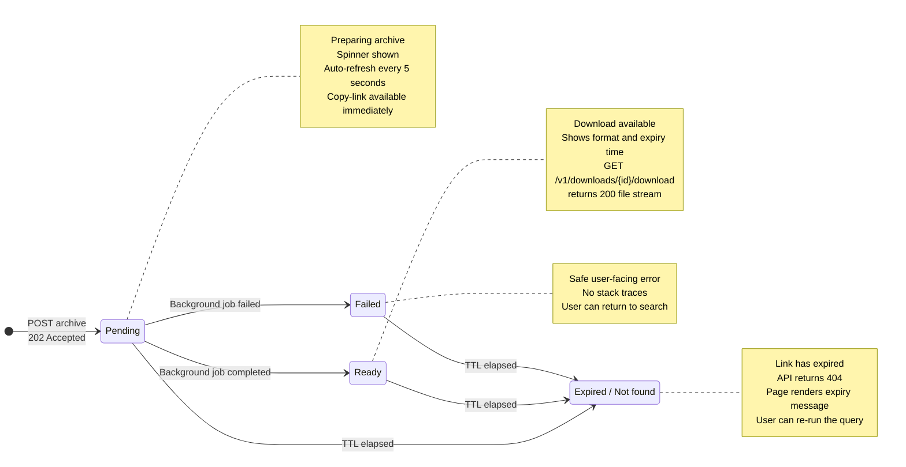

---

## Progressive KWIC Loading

**Status**: Implemented (all three phases). See [docs/change_requests/done/PROGRESSIVE-KWIC-LOADING.md](change_requests/done/PROGRESSIVE-KWIC-LOADING.md) for the full proposal.

Three layered capabilities shipped together:
- **Phase 1** — Pre-search estimate via `GET /v1/tools/kwic/estimate` (DTM column sum, < 20 ms)
- **Phase 2** — Threshold-based display mode with explicit banner (retired by Phase 3)
- **Phase 3** — Progressive shard delivery: `PARTIAL` status, per-shard artifact storage, progress bar in the frontend

The diagrams below cover Phase 1 (estimate) and Phase 3 (progressive delivery). Phase 2 was a transitional state and is not diagrammed separately.

### Sequence: Pre-search estimate

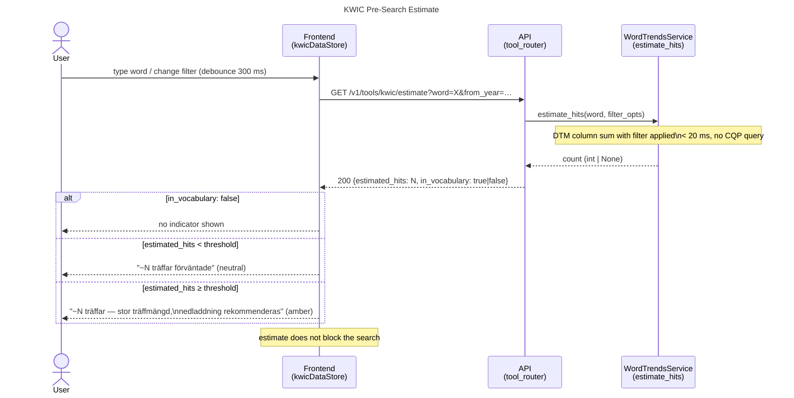

### Sequence: Progressive KWIC shard delivery (production mode)

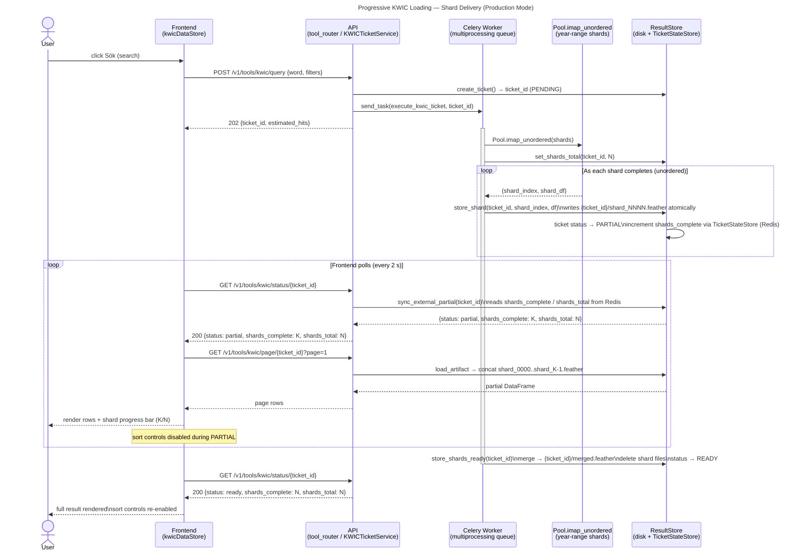

---

## Application Startup and Component Wiring

**Status**: Active runtime.

### Component: service graph built by AppContainer

```mermaid
flowchart TD
    main[main.py] --> create_app

    subgraph create_app["create_app()"]
        direction TB
        cfg[Configure ConfigStore] --> lifespan
        cors[Add CORS middleware]
        routers[Register routers\ntool / deprecated / metadata / downloads]

        subgraph lifespan["lifespan hook (startup)"]
            celery_cfg[Configure Celery\nif celery_enabled]
            container["AppContainer.build()\n→ app.state.container"]
            rs["ResultStore.from_config()\n→ app.state.result_store"]
            celery_cfg --> container --> rs
        end
    end

    subgraph AppContainer["AppContainer (app-scoped)"]
        direction TB
        CL[CorpusLoader]
        MS[MetadataService]
        WTS[WordTrendsService]
        NGS[NGramsService]
        SS[SearchService]
        STS[SpeechesTicketService]
        KS[KWICService]
        KTS[KWICTicketService]
        KAS[KWICArchiveService]
        WTSTS[WordTrendSpeechesTicketService]
        DS[DownloadService]
        ATS[ArchiveTicketService]

        CL --> MS
        CL --> WTS
        CL --> NGS
        CL --> SS
        CL --> STS
        CL --> KS
        CL --> KTS
        CL --> KAS
        CL --> WTSTS
        CL --> DS
        CL --> ATS
    end

    subgraph CorpusLoader["CorpusLoader (lazy)"]
        direction TB
        idx[prebuilt speech_index.feather]
        dtm[VectorizedCorpus DTM]
        repo[SpeechRepository\n→ SpeechStore]
        codecs[PersonCodecs / MetadataCodecs]
    end

    subgraph ResultStore["ResultStore"]
        direction TB
        disk[Disk artifacts\ncache.root_dir/{ticket_id}/]
        tss[TicketStateStore\nRedis optional]
        disk --- tss
    end

    container --> AppContainer
    rs --> ResultStore

    classDef svc fill:#e8f0fb,stroke:#5c8ac8,color:#1a2a4a;
    classDef store fill:#f0fbe8,stroke:#5ca85c,color:#1a3a1a;
    classDef lazy fill:#fff7d6,stroke:#d6a300,color:#2b2b2b;
    class MS,WTS,NGS,SS,STS,KS,KTS,KAS,WTSTS,DS,ATS svc;
    class ResultStore,disk,tss store;
    class idx,dtm,repo,codecs lazy;
```

---

## Ticket Status Lifecycle

**Status**: Active runtime. Applies to all ticket types: KWIC, speeches, word-trend speeches, and archive tickets.

### State: ticket status transitions

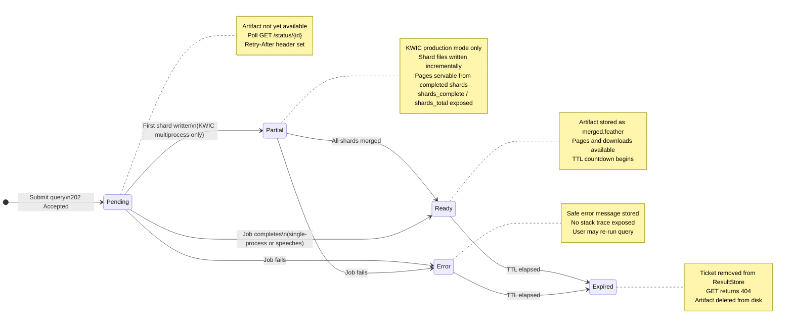

---

## Production vs Development Execution Mode

**Status**: Active runtime. Controlled by `development.celery_enabled` in `config.yml`.

### Flowchart: ticket execution path selection

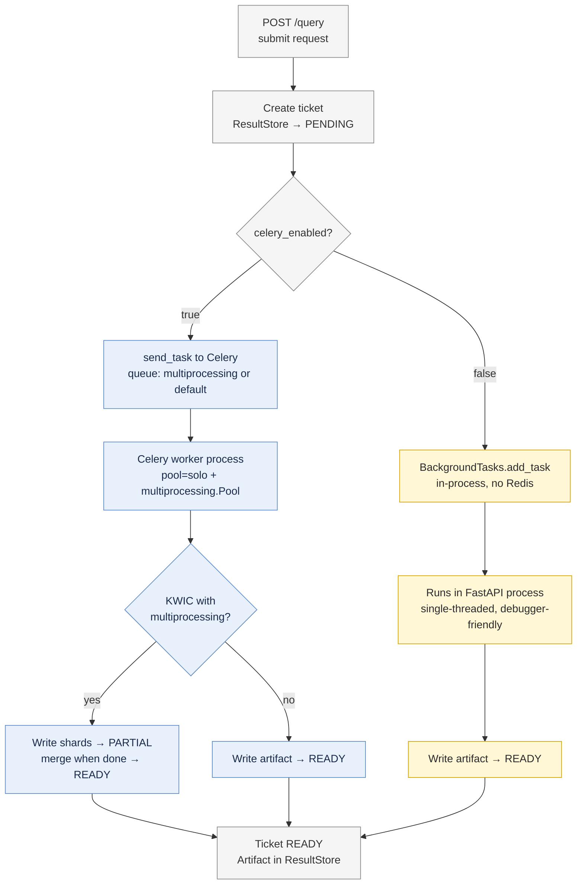

---

## Synchronous Word Trends Flow

**Status**: Active runtime. The word-trends chart request is synchronous because DTM aggregation is fast (cached corpus, no CQP).

### Sequence: word trends chart

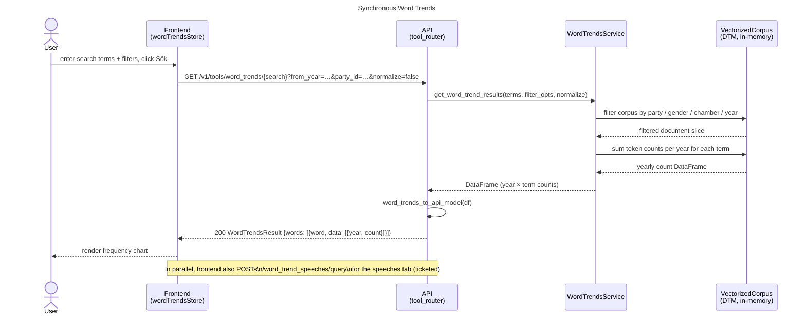

---

## Ticketed Speeches Flow

**Status**: Active runtime. Used by the ANFÖRANDEN tool.

### Sequence: speeches query, paging, and download

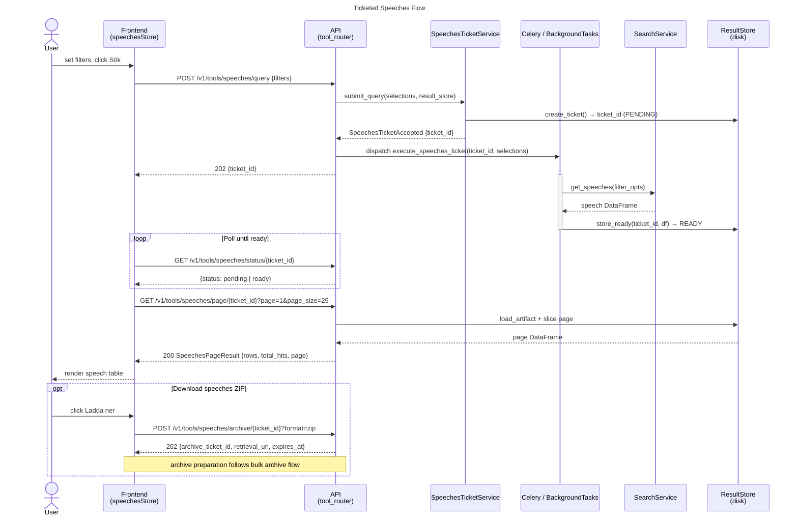

---

## Ticketed Word-Trend Speeches Flow

**Status**: Active runtime. Runs in parallel with the synchronous word-trends chart request so the speeches tab resolves asynchronously while the chart appears immediately.

### Sequence: word-trend speeches query and paging

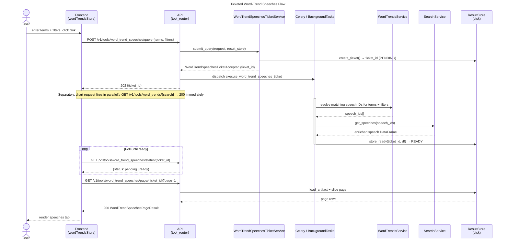

---

## N-grams Flow

**Status**: Active runtime. Uses the CWB/CQP path (distinct from the DTM path used by word trends and the estimate endpoint).

### Sequence: n-gram query

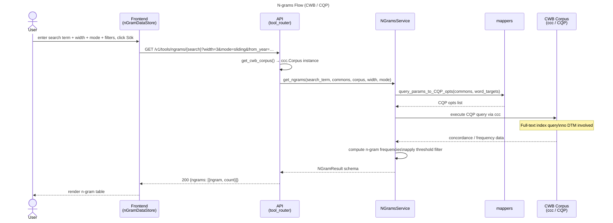

---

## Metadata Bootstrap and Filter Hydration

**Status**: Active runtime. Metadata is fetched once at frontend startup to populate filter dropdowns.

### Sequence: app boot metadata hydration

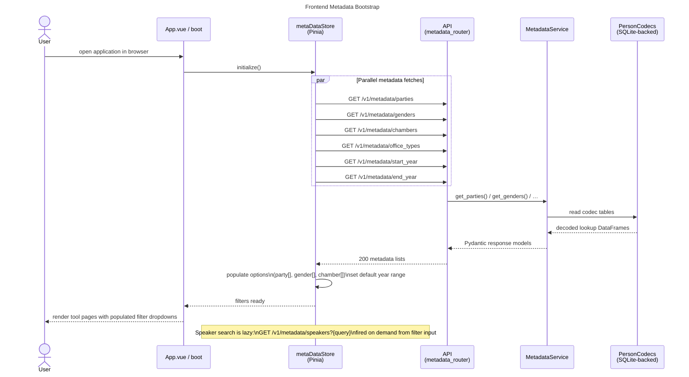
