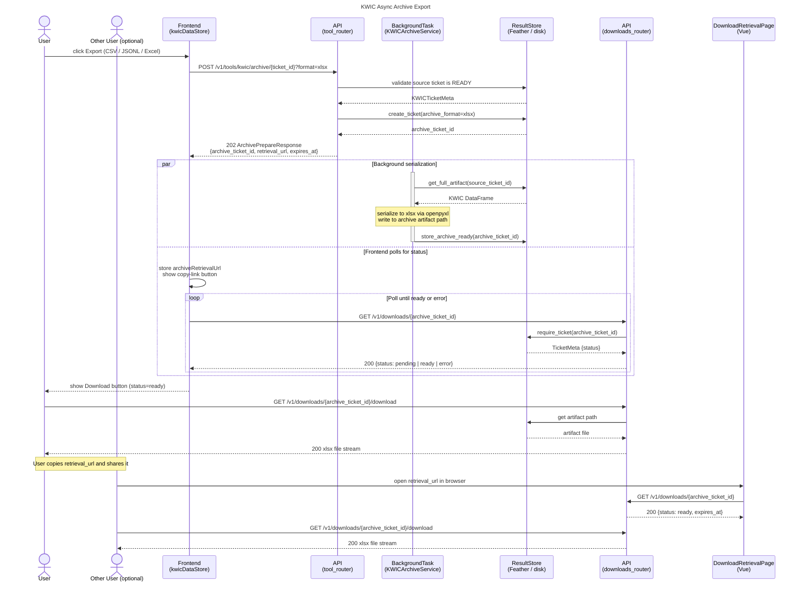
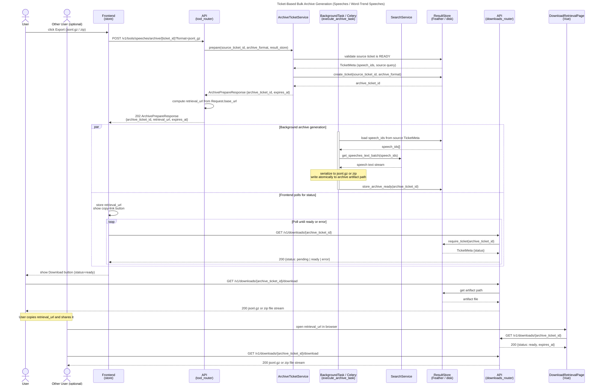
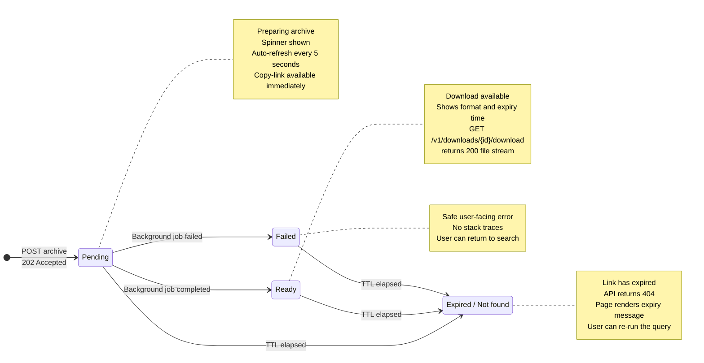
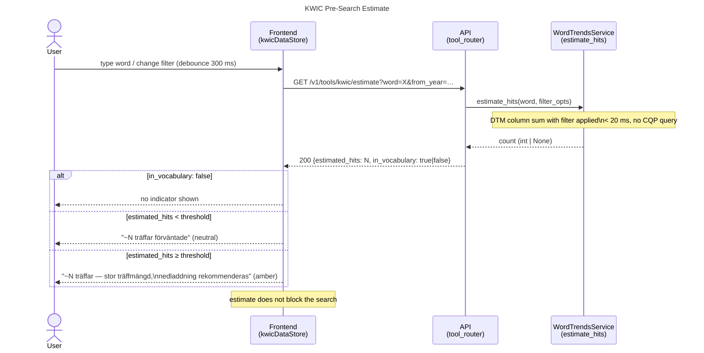
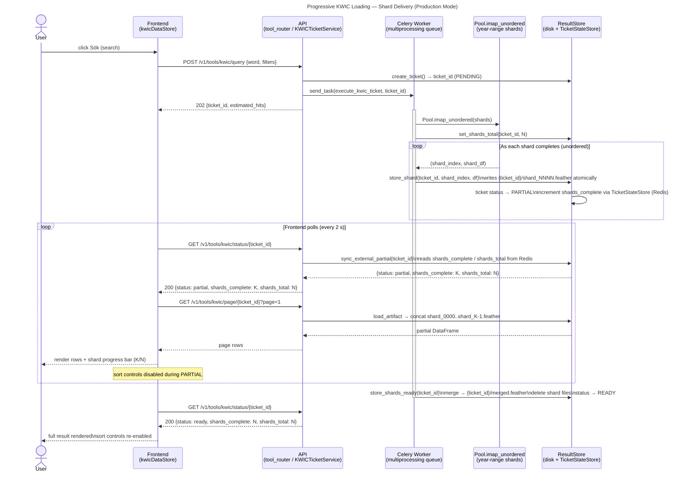

# Design Diagrams

This document collects architecture and design diagrams for the Swedeb API: sequence diagrams, state diagrams, component diagrams, and other visual documentation of system behavior and structure.

Diagrams here describe the **current or proposed active runtime**. Historical diagrams belong in `docs/archive/`. Proposal-specific diagrams may live in `docs/change_requests/` alongside the relevant proposal and be promoted here once implemented.

---

## KWIC Async Archive Export

**Status**: Implemented. See [docs/change_requests/done/KWIC_ASYNC_ARCHIVE_EXPORT.md](change_requests/done/KWIC_ASYNC_ARCHIVE_EXPORT.md) for the full proposal.

### Sequence: Async archive preparation and retrieval

---

## Ticket-Based Bulk Archive Generation (Speeches / Word-Trend Speeches)

**Status**: Implemented. See [docs/change_requests/done/TICKET_BASED_BULK_ARCHIVE_GENERATION.md](change_requests/done/TICKET_BASED_BULK_ARCHIVE_GENERATION.md) for the full proposal.

This flow applies to both:
- `POST /v1/tools/speeches/archive/{ticket_id}`
- `POST /v1/tools/word_trend_speeches/archive/{ticket_id}`

### Sequence: Async bulk archive preparation and retrieval

---

## Download Retrieval Page — Four States

**Status**: Implemented. See [docs/change_requests/done/TICKET_DOWNLOAD_URL_RETRIEVAL_PAGE.md](change_requests/done/TICKET_DOWNLOAD_URL_RETRIEVAL_PAGE.md) for the full proposal.

The Vue frontend route `/download/:archiveTicketId` (`DownloadRetrievalPage.vue`) renders one of four states based on the ticket status returned by `GET /v1/downloads/{archive_ticket_id}`. The inline polling flow (user stays on the tool page) is the primary path; the retrieval page is the fallback for tab-close, network loss, or sharing.

### State: ticket lifecycle and retrieval-page rendering

---

## Progressive KWIC Loading

**Status**: Implemented (all three phases). See [docs/change_requests/done/PROGRESSIVE-KWIC-LOADING.md](change_requests/done/PROGRESSIVE-KWIC-LOADING.md) for the full proposal.

Three layered capabilities shipped together:
- **Phase 1** — Pre-search estimate via `GET /v1/tools/kwic/estimate` (DTM column sum, < 20 ms)
- **Phase 2** — Threshold-based display mode with explicit banner (retired by Phase 3)
- **Phase 3** — Progressive shard delivery: `PARTIAL` status, per-shard artifact storage, progress bar in the frontend

The diagrams below cover Phase 1 (estimate) and Phase 3 (progressive delivery). Phase 2 was a transitional state and is not diagrammed separately.

### Sequence: Pre-search estimate

### Sequence: Progressive KWIC shard delivery (production mode)

