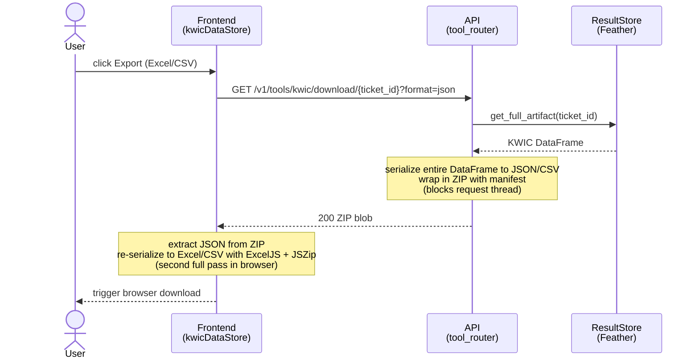
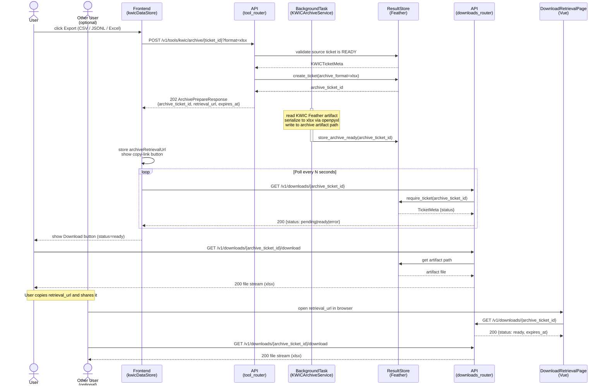

# KWIC Async Archive Export

## Status

- Proposed feature / change request
- Scope: backend + frontend
- Goal: replace the synchronous KWIC export with a background archive job and a shareable retrieval URL, consistent with the speeches and word-trend speeches export pattern

## Summary

Add `POST /v1/tools/kwic/archive/{ticket_id}` to offload KWIC export to a background job, return a `retrieval_url` from the prepare response, and wire the frontend copy-link button in the same way as the existing export components. Excel generation git pullis done server-side via `openpyxl`; no client-side fallback is needed.

## Problem

KWIC can produce very large result sets. The current export path is:

1. `GET /v1/tools/kwic/download/{ticket_id}?format=json` — serializes the full KWIC Feather artifact inline in the HTTP handler, wraps it in a ZIP, and streams it synchronously
2. The browser receives the ZIP, extracts the JSON payload, then re-serializes it into Excel or CSV using ExcelJS and JSZip in-memory

For large queries this means:
- The HTTP connection is held open for the full serialization time
- The browser does two full passes over the data: server-side serialization to JSON, then client-side re-serialization to Excel or CSV
- There is no shareable URL; the export is only reachable for the session that submitted the original query
- There is no copy-link button in the KWIC UI, unlike the speeches and word-trend speeches tables

## Scope

- New `KWICArchiveService` that serializes a KWIC Feather artifact to CSV or JSONL and writes it to `cache.root_dir/archives/`
- New `POST /v1/tools/kwic/archive/{ticket_id}` endpoint, returning `ArchivePrepareResponse` (same schema as speeches/word-trend speeches)
- Frontend: `archiveRetrievalUrl` state in `kwicDataStore`, `downloadKwicArchive()` action, and copy-link button in `kwicDataTable.vue`
- The generic `GET /v1/downloads/{id}` and `GET /v1/downloads/{id}/download` endpoints already handle all archive tickets and do not need to change

## Non-Goals

- Celery queue integration for KWIC archives: serializing a Feather is I/O-bound and fast; `BackgroundTasks` is sufficient here, consistent with development mode for other archives
- Changes to KWIC query submission or paged result endpoints

## Current Behavior

`GET /v1/tools/kwic/download/{ticket_id}` reads the stored KWIC Feather artifact via `KWICTicketService.get_full_artifact()`, serializes to JSON or CSV, wraps in a ZIP with a manifest, and streams the response inline. The frontend then re-processes the blob client-side.

The existing `ArchiveTicketService.execute_archive_task()` is designed for speech text archives (it reads `speech_ids` from the source ticket and calls `SearchService.get_speeches_text_batch()`). KWIC archives do not need speech text fetching — the KWIC data is already fully materialized in the Feather artifact.

## Proposed Design

### Backend

**New `KWICArchiveService`** (`api_swedeb/api/services/kwic_archive_service.py`):

- `prepare(source_ticket_id, archive_format, result_store)` — validates the source KWIC ticket is ready, creates an archive ticket, returns `ArchivePrepareResponse` with `expires_at`
- `execute_archive_task(archive_ticket_id, result_store)` — reads the KWIC Feather via `KWICTicketService.get_full_artifact()`, serializes to CSV, JSONL, or Excel (via `openpyxl`), writes to `result_store.archive_artifact_path(archive_ticket_id, format)`, calls `result_store.store_archive_ready()`
- Does not take or use `SearchService` — no speech text re-fetching needed

**New endpoint in `tool_router.py`**:

```python
@router.post(
    "/kwic/archive/{ticket_id}",
    response_model=ArchivePrepareResponse,
    status_code=202,
)
async def prepare_kwic_bulk_archive(
    ticket_id: str,
    request: Request,
    background_tasks: BackgroundTasks,
    archive_format: BulkArchiveFormat = Query(BulkArchiveFormat.jsonl_gz),
    kwic_archive_service: KWICArchiveService = Depends(get_kwic_archive_service),
    result_store: ResultStore = Depends(get_result_store),
) -> ArchivePrepareResponse:
    ...
    retrieval_url = str(request.base_url).rstrip("/") + f"/download/{response.archive_ticket_id}"
    response = response.model_copy(update={"retrieval_url": retrieval_url})
    background_tasks.add_task(kwic_archive_service.execute_archive_task, ...)
    return response
```

Wire `get_kwic_archive_service` in `dependencies.py`.

**Archive formats**: `jsonl_gz`, `zip` (wraps CSV), and `xlsx` (via `openpyxl`). `csv_gz` is also an option if wanted.

### Frontend

**`kwicDataStore.js`**:

- Add `archiveRetrievalUrl: null` to state
- Clear it in `resetTicketState()`
- Add `downloadKwicArchive(format = 'jsonl_gz')` action: POSTs to `/tools/kwic/archive/${this.ticketId}`, stores `prepareResponse.data.retrieval_url`

**`kwicDataTable.vue`** (or its owning component):

- Add `linkCopied` ref and `copyRetrievalLink()` — same pattern as `wordTrendsSpeechTable.vue` and `speechesTable.vue`
- Show copy-link button when `kwicStore.archiveRetrievalUrl && <download is active>`

**i18n**: all required keys already exist under `downloadRetrievalPage.*`.

## Sequence Diagrams

### Current flow (synchronous, blocks the connection)



### Proposed flow (async, shareable retrieval URL)



## Alternatives Considered

- **Keep inline export, add retrieval URL**: still blocks the HTTP connection during serialization; does not fix the core problem for large result sets
- **Move export to Celery**: no benefit for KWIC archives — the bottleneck is reading and writing a local Feather file, not multiprocessing or external I/O. `BackgroundTasks` is adequate

## Risks and Tradeoffs

- Excel is generated server-side via `openpyxl`. The client-side ExcelJS/JSZip path in `kwicDataStore.js` can be replaced entirely once the async endpoint is wired.
- The `KWICArchiveService` is a thin new service. The alternative is adding a generic "serialize Feather ticket to archive" path inside `ArchiveTicketService`, but that would mix KWIC and speech-text logic in one class. Prefer separation.
- KWIC Feather artifacts can be large. Serialization to JSONL in a background task will hold `cache.root_dir` disk space until expiry; this is the same tradeoff already made for speech archives.

## Testing and Validation

- Unit tests in `tests/api_swedeb/api/test_kwic_archive_endpoints.py` following the same fixture pattern as `test_archive_endpoints.py` and `test_downloads_router.py`
- Test cases: prepare returns 202 with `retrieval_url` and `expires_at`; pending source ticket returns 409; missing source ticket returns 404; `GET /v1/downloads/{id}` returns status; `GET /v1/downloads/{id}/download` returns file for ready ticket
- Manual: submit a KWIC query, trigger archive export, copy the URL, open in new tab, download file

## Acceptance Criteria

- `POST /v1/tools/kwic/archive/{ticket_id}` returns 202 with `retrieval_url` and `expires_at`
- `GET /v1/downloads/{archive_ticket_id}/download` serves the serialized KWIC artifact as CSV, JSONL, or Excel
- Copy-link button appears in the KWIC UI when an archive is being prepared
- The retrieval URL works on the existing `/download/:archiveTicketId` frontend page
- Client-side Excel generation via ExcelJS/JSZip is removed; all formats are served from the backend

## Recommended Delivery Order

1. `KWICArchiveService` and its unit tests
2. `POST /kwic/archive/{ticket_id}` endpoint and integration with `downloads_router`
3. Frontend store state and `downloadKwicArchive()` action
4. Copy-link button in `kwicDataTable.vue`

## Progress Checklist

### Backend

- [ ] Add `xlsx` to `BulkArchiveFormat` enum (or define a KWIC-specific format enum)
- [ ] Create `api_swedeb/api/services/kwic_archive_service.py` with `KWICArchiveService`
  - [ ] `prepare()` — validates source KWIC ticket is ready, creates archive ticket, returns `ArchivePrepareResponse`
  - [ ] `execute_archive_task()` — reads KWIC Feather, serializes to target format (CSV / JSONL / xlsx), writes artifact, marks ticket ready or failed
  - [ ] Excel serialization via `openpyxl` (or `pandas.to_excel`)
- [ ] Wire `get_kwic_archive_service()` singleton in `api_swedeb/api/dependencies.py`
- [ ] Add `POST /v1/tools/kwic/archive/{ticket_id}` to `tool_router.py`
  - [ ] Validate source ticket, call `kwic_archive_service.prepare()`
  - [ ] Compute `retrieval_url` from `request.base_url`
  - [ ] Schedule `execute_archive_task` as `BackgroundTasks` job
  - [ ] Return `ArchivePrepareResponse` (202)

**Completed (this branch):**
- [x] `ArchiveTicketService.build_file_response()` extracted — ticket validation, format parsing, `touch_ticket`, and `FileResponse` are now in one place; all three bulk-archive download endpoints delegate to it
- [x] `retrieval_url` included in `ArchivePrepareResponse` schema (`str | None`)
- [x] `retrieval_url` computed and set in both existing prepare endpoints (`/word_trend_speeches/archive/{ticket_id}` and `/speeches/archive/{ticket_id}`)
- [x] `GET /v1/downloads/{archive_ticket_id}` — generic status poll for any ticket
- [x] `GET /v1/downloads/{archive_ticket_id}/download` — generic file stream for any ready ticket

### Backend tests

- [ ] Create `tests/api_swedeb/api/test_kwic_archive_endpoints.py`
  - [ ] Prepare endpoint returns 202 with `retrieval_url` and `expires_at`
  - [ ] Pending source ticket returns 409
  - [ ] Missing source ticket returns 404
  - [ ] `GET /v1/downloads/{id}` returns pending/ready status
  - [ ] `GET /v1/downloads/{id}/download` streams artifact for ready ticket

**Completed (this branch):**
- [x] `test_downloads_router.py` — covers `GET /v1/downloads/{id}` status (all states) and `GET /v1/downloads/{id}/download`
- [x] `test_downloads_router.py` — verifies `retrieval_url` and `expires_at` are present in prepare responses for both existing tools

### Frontend

- [ ] Add `archiveRetrievalUrl: null` to `kwicDataStore` state
- [ ] Clear `archiveRetrievalUrl` in `resetTicketState()`
- [ ] Add `downloadKwicArchive(format)` action: POST to `/tools/kwic/archive/{ticketId}`, store `retrieval_url`
- [ ] Add `linkCopied` ref and `copyRetrievalLink()` to `kwicDataTable.vue`
- [ ] Show copy-link button when `archiveRetrievalUrl` is set
- [ ] Remove client-side Excel generation (ExcelJS/JSZip path in `kwicDataStore.js`)

**Note:** `archiveRetrievalUrl` and the `downloadKwicArchive()` pattern are already implemented in `downloadDataStore.js` and `wordTrendsDataStore.js`. `kwicDataStore.js` still uses client-side ExcelJS/JSZip; the backend endpoint does not exist yet so these cannot be removed yet.

### Validation

- [ ] `pnpm lint` clean
- [ ] `make lint` / `make tidy` clean
- [ ] All new and existing archive/download tests pass
- [ ] Manual smoke test: submit KWIC query → export → copy link → open in new tab → download

## Open Questions

- Should the async archive replace the existing download buttons in the UI entirely, or keep the synchronous endpoint as a fast path for small result sets?
- KWIC Feather columns include raw and joined metadata. Should the archive omit any columns (e.g. internal integer IDs) for cleaner output? A column allowlist would mirror `USED_COLUMNS` on the load path.

## Final Recommendation

Add the async KWIC archive path. The work is small (thin new service, one new endpoint, store state and one button), the pattern is already established and validated, and the behavior gap is real for large KWIC exports.
